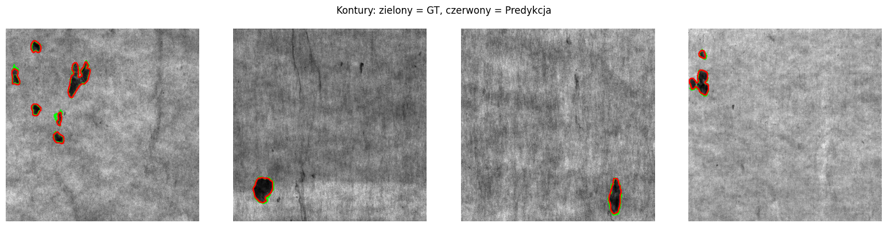

# Wool Defect Segmentation

Binary segmentation of defects in wool fabric images using U-Net with a ResNet34 encoder. Built with PyTorch & Lightning.

## Overview

The model takes single channel wool raw images and outputs a binary mask highlighting defective regions. Input images are 448x448 `.npy` arrays, masks are `.png` files.

Training uses Albumentations library for augmentation and a combined Focal + Tversky (or BCE + Dice) loss. The encoder is initially frozen and gradually unfrozen during training. Post-processing (morphological closing + small blob removal) is applied to clean up predictions.

## Metrics

F1, Precision, Recall, IoU (with and without post-processing).

